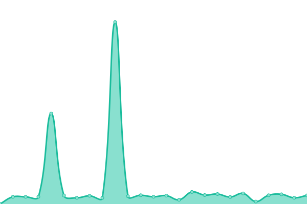

# [📈 Live Status](https://NeilDevelopment.github.io/status): <!--live status--> **🟧 Partial outage**

<!--start: status pages-->
<!-- This summary is generated by Upptime (https://github.com/upptime/upptime) -->
<!-- Do not edit this manually, your changes will be overwritten -->
<!-- prettier-ignore -->
| URL | Status | History | Response Time | Uptime |
| --- | ------ | ------- | ------------- | ------ |
|  [Neil Development](https://neildevelopment.xyz) | 🟩 Up | [neil-development.yml](https://github.com/NeilDevelopment/status/commits/HEAD/history/neil-development.yml) | 

 199ms
     
 | 

<a href="https://NeilDevelopment.github.io/status/history/neil-development">99.82%</a>
    

|  [Paste](https://paste.neildevelopment.xyz) | 🟥 Down | [paste.yml](https://github.com/NeilDevelopment/status/commits/HEAD/history/paste.yml) | 

 1298ms
     
 | 

<a href="https://NeilDevelopment.github.io/status/history/paste">30.49%</a>
    

<!--end: status pages-->

[**Visit our status website →**](https://NeilDevelopment.github.io/status)

## 📄 License

- Powered by: [Upptime](https://github.com/upptime/upptime)
- Code: [MIT](./LICENSE) © [Neil Development](https://neildevelopment.ml)
- Data in the `./history` directory: [Open Database License](https://opendatacommons.org/licenses/odbl/1-0/)
